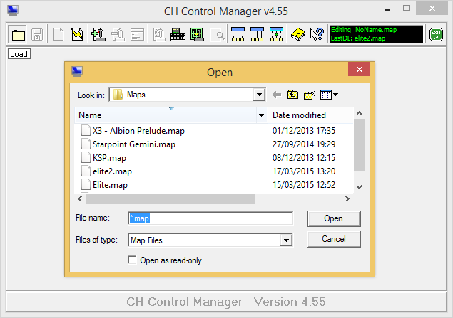
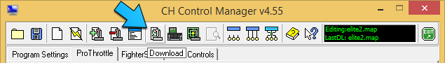

# CH Products Joystick Map for Elite: Dangerous

Joystick maps and game configuration files for the [CH Products][] [Fighterstick][] and [Pro Throttle][] HOTAS in [Elite: Dangerous][].

## About

The main map is my own personal configuration that I've put together while playing Elite: Dangerous. The _redux_ map is a simplified version of this that maintains core functionality, but with a single modifier button. The maps have evolved over time and are presented here as it's a much easier way of distributing changes. As the game evolves you may see additional changes. Feel free to download, use and tweak for your own setup.

### Version

This version of the map is designed for use with Elite: Dangerous 1.2.03 and above. It's split into two parts: _full_ and _redux_. Both maps share the same in game config, _redux_ just doesn't make use of all of the available mappings.

### Previous versions

Previous versions of the joystick maps, including the relevant README.md and layout guides, can be found [here][previous]. Major version number changes indicate complete overhauls of the map.

## Requirements

* [CH Products][] [Fighterstick][]
* [CH Products][] [Pro Throttle][]
* [CH Products][] [Control Manager][] software
* [Elite: Dangerous][] 1.2.03 or above
* Optional: PDF viewer

## Installation

Download and extract the [zip file][] containing the game files.

### Joystick Maps

Navigate to `My Documents` and create a folder called `CH Control Manager` if it doesn't already exist, and under it a folder called `Maps`.

Within the extracted zip file under the `maps` folder you'll find four files. These need to be copied to the `CH Control Manager/Maps` folder.

Plugin your [Fighterstick][] and [Pro Throttle][], then launch the [CH Control Manager][Control Manager]. Load the either `full.map` or `redux.map` depending on your preference. The load dialog should default to the folder you copied your maps to. If it doesn't just navigate to that folder. 

Once loaded click the `Download` button to enable the map.

### Game Configuration

Within the extracted zip file under the `config` folder you'll find two files called `Custom.binds` and `StartPreset.start`. Copy `Custom.binds` to
`%LOCALAPPDATA%\Frontier Developments\Elite Dangerous\Options\Bindings\Custom.binds`. `%LOCALAPPDATA%` points to the hidden `AppData\Local` folder for _your_ Windows account. The `Custom.binds` file works for both the _full_ and _redux_ maps.

You can optionally copy `StartPreset.start` to the same folder. All this does is tell the game to use the custom bindings by default. If you don't copy the file you'll need select the custom layout from within the game under the input settings.

## Cheat Sheets and Details 

Within the extracted zip file, under the `layouts` directory, you'll find the PDF cheat sheet for each map. [full.pdf][full-layout] is for the _full_ map, [redux.pdf][redux-layout] is for the _redux_ map.

A complete description of the _full_, and _redux_ map can be found in [full.md][full] and [redux.md][redux] respectively.

## Conventions

These maps uses a few basic conventions. Buttons and Axis are denoted using `fixed width` type. In game actions are given in _italics_ . Button and hat numbers can be found on the Cheat Sheet.

The [Fighterstick][] is referred to as `Stick` and the [Pro Throttle][] is referred to as `Throttle`.

Axis are referred to using `Device axis` where `axis` is either `x`, `y` or `z`. `Stick x` and `Stick y` are left/right and forward/back respectively. `Stick z` is the throttle wheel. `Throttle x` and `Throttle y` are mini-stick left/right and mini-stick up/down respectively. `Throttle z` is the throttle axis. 

Individual buttons are referred to using the format `Btn n` where `n` is the button number from the cheat sheet. This can be prefixed with `Throttle` or `Stick`.

Hats are referred to using the format `Hat n` where `n` is the hat number from the cheat sheet. This can be prefixed with `Throttle` or `Stick`.

Individual hat buttons are referred to using the direction you need to move the hat to activate the button. For most hats this is `Up`, `Down`, `Left` and `Right`. The exception here is `Stick Hat 3` which uses `Forwards` and `Backwards` instead of `Up` and `Down`.

POV Hat buttons are referred to in a similar way to hats, except they use `POV` instead of `Hat n`. For example: `Stick POV Up`.

Modifier buttons are referred to as `shift` (`Stick Btn 4`) and `alt` (`Throttle Btn 3` - _full_ map only). Where a modifier is used it is written as `modifier` + `button` where `modifier` is either `shift` or `alt`, and `button` is the button or hat switch to press at the same time. Modifiers can stack, so `shift` + `alt` + `button` is valid and means you need to press 3 buttons to achieve the effect.

## Adding Rudder Pedals

I no longer own the CH Products [Pro Pedals][], however, I have had experience using them. You can add them to these maps by clicking the `Add Device` button and selecting the pedals from the list. Order is important in Joystick maps so ensure they are the 3rd device (**4th** tab), otherwise the CMS script will need to be updated with the new position for the Throttle.

> **Note:** If you want to use CMS scripts for your pedals and you're using the _full_ map please see [these notes][notes].

## Possible Future Enhancement

With the addition of the new modifier button there are now many duplicate bindings that can be used to map new controls too. The underlying CMS scripts and buttons assignments have been written to be easily expandable. This allows for 33 usable buttons and one POV hat giving a total of 144 button bindings and 8 POV directions. Radical future changes are therefore unlikely to the _full_ map.

The _redux_ map has very few spaces left so may lose the presets and/or wings controls to allow for new bindings.

  * If we end up with an Iron Man mode and an eject button this may get mapped to `shift` + `alt` + `Throttle Hat 1 Down` on the _full_ map and `shift` + `Throttle Btn 1` on the _redux_ map.
  * _Increase_/_Decrease Throttle_ may get mapped to `shift` + `Stick Hat 3 Forwards`/`Backwards` on the _full_ map to allow for single hand flying while typing.
  * The _Yaw/Roll Button_ may get replaced with a button on the _full_ map that actually swaps `Stick x` for a _Yaw_ axis, and then remaps _Yaw Left_/_Right_ to _Roll Left_/_Right_.
  * For technical reasons I want to look at changing _Stick Hat 3_ to using axis rather than buttons. This change would be reflected on both maps, although isn't a technical requirement for the _redux_ map.

## About The Author

This was all put together by [Cmdr Davis][]. There's also a [blog][] and [YouTube][] videos relating to [Elite: Dangerous][]. If you see me in game, say "Hi".

## Misc

I found the template I use for printing my joystick cheat sheets years ago on the internet but I've completely forgotten where from. If you can steer my in the correct direction so I can credit the original author I'd greatly appreciate it. 

## Caveat Emptor

With the exception of the PDF all the files contained in this project are text files so, in theory, nothing bad can happen to your system. That said, you're messing about with game config files so if you break anything, you get to keep both halves. If in doubt always back up.

## Changelog

### Version 2.1.1

  * Added binding to show CQC scores

### Version 2.1.0

This change simply adds the _redux_ version of the map. No changes have been made to the _full_ map other than the location of the files and some fixes to the description.

### Version 2.0.0

  * New `alt` modifier button added
  * All in game controls either have a button, keyboard or axis mapping
  * Moved all fire actions to the trigger (`Stick Btn 1`)
  * Moved all countermeasure actions to `Stick Btn 3`
  * Added new power presets
  * Moved _Silent Running_ to `shift` + `alt` + `Stick Btn 2`
  * Moved _Reset Head-Look_ and _Toggle Dev Camera_ to the `Stick POV Hat`
  * `Stick z` now mapped to _Scanner Range_
  * `Throttle Btn 4` now handles UI Input, UI Back and `ESC`
  * `Throttle POV Hat` now handles all UI movement
  * `Throttle Hat 2` now handled all UI panels and maps
  * Added more functions to `Throttle Hat 1`
  * Wingman functions moved to `Throttle Hat 3`
  * No longer use `Throttle Btn 1`
  * Entire map is now virtual
  * Complete rewrite of the README

### Version 1.2.1

  * Remove mouse axis from head-look so mouse head-look off is now honoured

### Version 1.2.0

Improvements for the 1.2 release:
  
  * Headlook is now always on
  * Mouse headlook is disabled
  * Headlook reset has been relocated to `shift`+`btn 2` on the `Stick` (was
    previously `btn 3`)
  * `btn 3` on the `Stick` is now _Fire Primary and Secondary Weapons_
  * `shift`+`btn 3` on the `Stick` is now _Fire Chaff_ (was previously 
    `shift`+`btn 2`)
  * _Galaxy Map_ has been moved to `btn 3` on the `Throttle` (was previously 
    `shift`+`btn 3`)
  * `shift`+`btn 3` on the `Throttle` is now bound to `ESC`
  * The `POV Hat` on the `Throttle` has had _Wingman_ functions mapped to its
    `shift` function
  * `shift`+`Throttle Hat 2 Up` is now _Comms Pannel_ (was previously `btn 3`)
  * `shift`+`Throttle 2 Hat` has had functions mapped to it
  * Tidied up README

### Version 0.0.5 (Previously version 5)

Improvements for the Gamma release:
  
  * Split Frameshift controls so Hyperdrive and Sepercruise are now seperate 
    buttons
  * Replaced binding to the `ESC` key to the provided `UI Back` control
  * Bound _Galaxy Map_ to a button
  * Bound _Use Shield Cell_ and _Fire Chaff_ to buttons. _Fire Chaff_ replaces 
    _Fire Heat Sync_ on the `Stick` and now lives with  _Use Shield Cell_ on the `Throttle`
  * Minor tweaks to axis direction in the _Galaxy Map_
  * Minor tweaks to the way headlook works with the mouse and bindings
  * Added changelog :)

[full-layout]: layouts/full.pdf
[redux-layout]: layouts/redux.pdf
[full]: layouts/full.md
[redux]: layouts/redux.md
[previous]: https://github.com/domdavis/ch-products-elite-map/releases/
[CH Products]: http://www.chproducts.com/
[Fighterstick]: http://www.chproducts.com/Fighterstick-v13-d-722.html
[Pro Throttle]: http://www.chproducts.com/Pro-Throttle-v13-d-719.html
[Elite: Dangerous]: http://www.elitedangerous.com/
[zip file]: https://github.com/domdavis/ch-products-elite-map/archive/master.zip
[Control Manager]: http://www.ch-hangar.com/forum/index.php/files/file/49-control-manager/
[Pro Pedals]: http://www.chproducts.com/Pro-Pedals-v13-d-716.html
[Cmdr Davis]: https://twitter.com/cmdr_davis 
[blog]: http://elite.domdavis.com
[YouTube]: https://www.youtube.com/user/idomdavis
[notes]: notes.md
